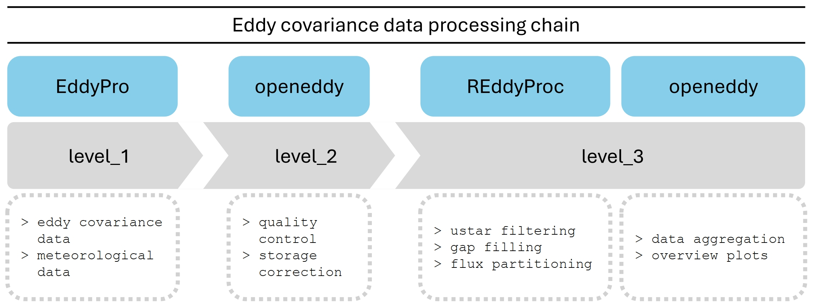
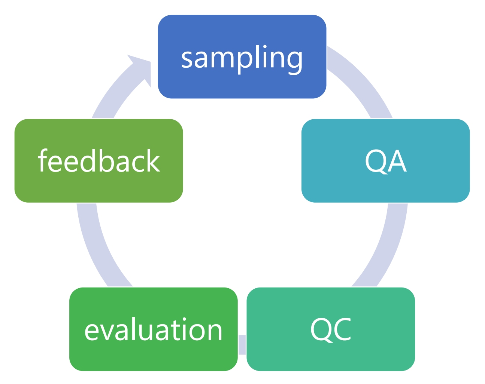
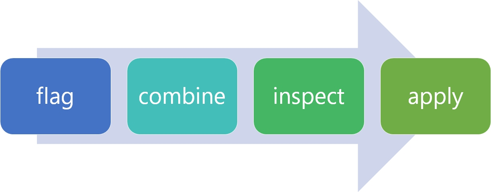
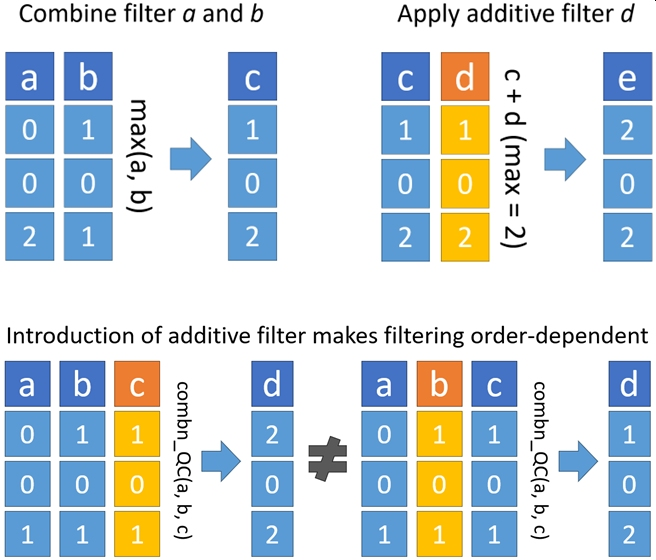

<!-- README.md is generated from README.Rmd. Please edit that file -->

```{r, include = FALSE}
knitr::opts_chunk$set(
  collapse = TRUE,
  comment = NA,
  fig.path = "README-",
  out.width = "100%"
)
```

# Eddy covariance workflow

## Overview

The eddy covariance (EC) workflow demonstrates how to use
[openeddy](https://github.com/lsigut/openeddy) package together with
[REddyProc](https://github.com/bgctw/REddyProc) package to facilitate
automated and reproducible EC data post-processing, supporting Tau, H,
LE and CO<sub>2</sub> (NEE) fluxes. The presented EC workflow is a set
of post-processing steps that were applied for a particular cropland
site
[CZ-KrP](http://www.europe-fluxdata.eu/home/site-details?id=CZ-KrP). The
main purpose of EC workflow is to show how to utilize the `openeddy`
software infrastructure. It is not meant to represent the optimal best
post-processing workflow, especially concerning the quality control. The
`openeddy` provides enough flexibility for users to adapt
post-processing to specifics of their site and will hopefully facilitate
discussion and exchange of best practices concerning various types of
ecosystems and EC setups.

Comments in the workflow files explain how individual steps lead to the
desired output. If you look for the settings and details about the
`openeddy` functions, see their respective help files
(`?function_name`). Notice that there is also a set of interactive
[openeddy tutorials](https://github.com/lsigut/openeddy_tutorials) that
provide more context.

## Requirements

The EC workflow is currently aligned with `EddyPro` software
[output](https://www.licor.com/env/support/EddyPro/topics/output-files-full-output.html).
It is expected that meteorological data passed its own separate workflow
(not in the scope of `openeddy`), i.e. they are already converted to
physical units, underwent quality control and are gap-filled.

List of expected meteorological variables (see [Naming strategy with the
EC workflow]):

| Recommended setup                        | Minimum setup |
|:-----------------------------------------|:--------------|
| GR, PAR, Rn, Tair, Tsoil, VPD (or RH), P | GR, Tair      |

Gaps in meteorological data are allowed (except for global radiation,
GR, needed for day/night data separation in `despikeLF()`), but
`REddyProc` gap filling of meteorological data performs well mostly for
short gaps. Minimum setup describes bare minimum needed for used
functions and would require adaptations of the workflow.

Processing of multiple or incomplete years is supported but it requires
edits in EC workflow scripts. Note that for data fragments shorter than
a half year the processing (mainly `REddyProc` gap filling and flux
partitioning) might not be reliable. `REddyProc` has defined constraints
that has to be met, otherwise processing will not proceed and
informative error message should be produced. Note that `REddyProc` is
meant to fill the gaps within the period when sampling occurs, instead
of extrapolating data from a short measurement period to a much larger
period (e.g. you cannot use few months of measurements to obtain annual
budgets).

**Adapting workflow for a new site** mainly requires to edit the
`KRP16_0_settings_2025-04-27.R` file according to provided comments.
Other workflow files should remain unchanged. Settings edits include
renaming of meteorological variables to workflow standard (`Met_mapping`
object) and defining region of interest (ROI) `boundary`. In order to
run `fetch_filter()`, `QC` workflow requires the ROI `boundary` for
given site-year. ROI is provided by the user in a form of numeric vector
(see [ROI boundary] section below and
<https://github.com/lsigut/ROI_boundary>).

Support for other EC processing
[software](https://ameriflux.lbl.gov/resources/resource-list/tools-and-software-for-flux-scientists/raw-data-processing-and-qa-qc/)
(e.g. TK3, EdiRe, EddyUH, EddySoft) is not explicitly provided but
alternative workflow should be achievable already with the existing
`openeddy` capabilities. The easiest approach could be to `remap_vars()`
using the pairing of column names of `EddyPro` full output and the EC
processing software used. `EddyPro`-specific tests/filters mainly
present in `extract_QC()` would need to be substituted for their
alternatives. Similarly, support for CH<sub>4</sub>, N<sub>2</sub>O or
other trace gases is not planned, however they should be feasible to
some degree (note that look-up tables might not be optimal for gap
filling of such fluxes).

## Usage

To run EC workflow for the example site-year `KRP16`:

Download `KRP16 - before processing.zip` from
[Zenodo](https://doi.org/10.5281/zenodo.1442530) and unzip. Run workflow
files in specified order according to instructions there:

1.  `WF_1_data_preparation`: formatting and merging inputs.
2.  `WF_2_QC`: eddy covariance quality control and storage correction.
3.  `WF_3_GF_&_FP`: uStar filtering, gap filling and flux partitioning.
4.  `WF_4_Summary`: aggregation and plotting of results.

For a new site-year, `settings` workflow file should be edited first.
File prefix `KRP16` can be changed to identify related site-year. Date
suffix identifies workflow version and should not be edited. Workflow
file `utilites` is required by the workflow scripts and is not meant for
user interaction.

Commands in `WF_1` and `WF_2` should be run one by one, to get better
feedback about problems with data inputs or data quality. Especially
`WF_2` includes interactive function (`check_manually()`) that requires
direct user input. `WF_3` should require minimal user supervision.
`WF_4` can be `source()`d.

Note that using `source()` for the QC workflow will not produce desired
outcome if variable `interactive = TRUE` because `check_manually()` will
expect interactive session (manual marking of outliers). Once the manual
QC is finalized and saved, changing to `interactive = FALSE` in
`settings` allows to reproduce the results by sourcing.

You can compare your results with those of `KRP16 - processed.zip` at
[Zenodo](https://doi.org/10.5281/zenodo.1442530). Notice that in order
to obtain identical results, you would need to copy the subjective
manual screening done by site PI located at
`.\level_2\quality_checking\KRP16_manual_QC.csv`.

## Description

The proposed workflow allows to process eddy covariance data with single
processing chain consisting of four stages:

1.  **Data preparation:** prepare data for QC. Meteo data and EddyPro
    full output files are validated, accordingly formatted, merged and
    saved with documentation. All numeric values are rounded to a
    reasonable precision. Meteo variable names are remapped according to
    the requirements of `openeddy` and `REddyProc` packages.
    `WF_1_data_preparation` produces files at `.\level_1\input_for_qc\`
    folder.

2.  **Quality control:** load the `EddyPro` output and gap-filled
    meteorological data and apply automated tests and filters
    implemented in `openeddy` to quality check fluxes of momentum (Tau),
    sensible (H) and latent heat (LE) and net ecosystem exchange (NEE).
    Perform storage correction of fluxes using discrete (one point)
    storage estimate available in the `EddyPro` full output. While this
    is sufficient for sites with short canopy (e.g. the example cropland
    site `CZ-KrP`), one point approximation is less suitable with
    increasing EC measurement height. Computation of storage flux from
    profile measurements is not in the scope of `openeddy`. Export
    documentation of applied QC and produce the outputs needed in next
    steps. `WF_2_QC` produces files at `.\level_2\quality_checking\` and
    `.\level_2\input_for_gf\` folders.

3.  **Gap filling and flux partitioning:** use `REddyProc` to estimate
    uStar threshold, apply uStar filtering, gap fill (H, LE, NEE) and
    partition (NEE) fluxes. Use `openeddy` to visualize H, LE and NEE
    fluxes. The setup allows to change and document some processing
    options in an organized way. `WF_3_GF_&_FP` produces files at
    `.\level_3\gap_filling\`.

4.  **Summary:** visualize processed data, convert units and aggregate
    results to daily, weekly, monthly and yearly timescales. A limited
    amount of computed parameters is also produced, including different
    uncertainty estimates. `WF_4_Summary` produces files at
    `.\level_3\summary\`.

The EC workflow assumes certain folder structure for each site-year that
makes data handling more effective. The folder structure can be created
using `make_paths()` with following content:

```{r echo=FALSE, message=FALSE}
library(openeddy)
library(fs)
zz <- make_paths("site_year", create_dirs = TRUE)
fs::dir_tree("site_year")
unlink("site_year", recursive = TRUE)
```

-   Level 1: half-hourly data processed by `EddyPro` and gap-filled
    meteorological data.
-   Level 2: results and documentation of QC, storage corrected fluxes
    for GF & FP.
-   Level 3: results of GF & FP and the data set summaries.

The complete processing chain in the context of above folder structure
can be summarized as:



## QC principles

Quality assurance (QA) is always preferred to QC. If faulty instrument
producing spurious measurements can be exchanged, repaired or
calibrated, it is always preferred to simply flagging and removing
affected period. This requires frequent check of instruments, timely
maintenance, well educated technical support and established service
routine or calendar. Therefore QC cannot substitute neglected QA and the
concept "garbage in, garbage out" applies also for EC workflow. QA and
QC can be understood also as a learning process described in the
following diagram.

<p align="center">



</p>

In `openeddy`, `EddyPro` software serves as a way of input data
standardization. Data frames have defined column names and units with
conserved data formatting. This property is used to easily read the
expected columns, thus the typical input data structure of most
functions is a data frame. Quality control consists of two phases:

1.  obtaining QC filters (filters must be defined and columns containing
    QC flags saved to a data frame)

2.  applying QC filters (either directly by removing flux values or by
    combining all applied filters and assuring that data will be
    interpreted in respect to the combined QC flags).

This approach allows to evaluate a complete set of QC filters and select
for application only those with the best flagging efficiency (trade-off
between the count of removed spurious records and the amount of
available records after the QC filter application). Note that such
selected QC scheme can depend also on the type of follow up analysis
(data application). E.g. if the data will be used to compute annual
budgets, outlying values would bias the look-up table statistics when
filling gaps and thus should be removed. On the other hand, if the focus
of following analysis are exceptional fluxes, outlying values should be
kept and analyzed.

<p align="center">



</p>

The application of QC filters depends on whether the applied filters are
independent (most of the QC filters; QC flags are interpreted
independently on their order as maximum value is taken) or additive
(*wresid* and *interdep* filters; they serve as flag corrections and
thus the outcome depends on their position within the QC workflow).

<p align="center">



</p>

### Flagging scheme

-   flag 0 – high quality
-   flag 1 – minor issues
-   flag 2 – major issues

Due to the strict testing withing the QC workflow, both flag 0 and flag
1 data are suggested to be used for fundamental research. Only flag 2
(low data quality) is meant to be discarded. Note that if QC filter A
and filter B both flag 25% of data with flag 2, the fraction of excluded
data is typically lower than 50%. This is because the averaging periods
with major issues are often flagged by multiple filters.

## ROI boundary

The outline delimiting the spatial extent of the studied ecosystem
(region of interest; ROI) is specified by its ROI boundary that
describes the distance from EC tower to the edge of the studied
ecosystem for given wind direction. In order to work with `openeddy`,
ROI boundary has to be provided as a numeric vector with following
properties:

-   The number of circular sectors is the same as the number of provided
    distances (length of the vector).
-   The angular resolution of the ROI boundary is given by
    `360° / number of angular sectors`.
-   The ROI boundary distances are assigned to the centers of their
    respective circular sectors with first sector centered on 0°.

### ROI boundary example

<p align="center">


</p>

In this simplified case ROI boundary would be specified as:

``` r
c(150, 200, 250, 300)
```

**Interpretation:**

-   There would be 4 circular sectors with 90° angular resolution.
-   ROI boundary is specified for the whole first sector (315°, 45°] at
    the distance 150 m from tower (center of the sector is 0°).
-   Boundary of the second sector (45°, 135°] is at the distance 200 m.
-   Third sector (135°, 225°] is at the distance 250 m.
-   Fourth sector (225°, 315°] is at the distance 300 m.

Realistic representation of ROI boundary can look e.g. like this:


## Change of EC system or EddyPro settings

Functions `extract_QC(..., filters = c("missfrac", "wresid"))` and
`interdep()` require information about EC or EddyPro setup. For
*missfrac* filter it is the number of records in averaging period (e.g.
36 000 for half-hourly period with 20 Hz measurements), for *wresid* it
is the coordinate rotation type (double or planar fit rotation), for
*interdep* it is the infrared gas analyzer type (either open path or
(en)closed path). These specifications can be provided as single values
if the properties did not change throughout the data set. If the
properties changed (typically when merging multiple EddyPro files from
extended period), user can provide additional columns ("max_records",
"used_rotation", "used_IRGA") by `label_periods()` to specify these
properties for each averaging period (see relevant function help files:
`?extract_QC`, `?interdep`, `?label_periods`). For the columns to be
recognized, respective changes need to be made also in QC workflow (see
the description there).

## Naming strategy with the EC workflow

In order to take advantage of `openeddy` default arguments, certain
naming strategy is recommended.

`EddyPro` full output [variable
names](https://www.licor.com/env/support/EddyPro/topics/output-files-full-output.html)
are used with a few modifications if symbols were included in the
variable name (e.g. Monin-Obukhov stability parameter `(z-d)/L` is
corrected to `zeta`).

Expected names of meteorological variables are due to historical
reasons:

-   GR: global radiation [W m-2]
-   PAR: photosynthetically active radiation [umol m-2 s-1]
-   Rn: net radiation [W m-2]
-   Tair: air temperature at EC height [degC]
-   Tsoil: soil temperature at soil surface [degC]
-   RH: relative humidity at EC height [%]
-   VPD: vapor pressure deficit at EC height [hPa]
-   P: precipitation [mm]

`openeddy` offers full flexibility concerning QC column names. However,
in order to avoid QC column duplication and to partly document the type
of QC test/filter and flux that it corresponds to, following naming
strategy was devised:

### QC prefixes

They specify which flux is affected by given QC column:

-   qc_Tau\_, qc_H, qc_LE, qc_NEE: only applicable for the respective
    fluxes.
-   qc_SA\_: applicable to fluxes relying only on sonic (Tau, H).
-   qc_GA\_: applicable to fluxes relying on GA (LE, NEE); only GA
    issues considered.
-   qc_SAGA\_: applicable to fluxes relying both on SA and GA (LE, NEE);
    both SA and GA issues considered.
-   qc_ALL\_: applicable to all fluxes (in practice often not applied to
    Tau).

### QC suffixes

They specify which QC test/filter was applied to get the QC flags:

-   \_SSITC: steady state test and test of integral turbulence
    characteristics.
-   \_spikesHF: check of [high frequency data spike
    percentage](https://www.licor.com/env/support/EddyPro/topics/despiking-raw-statistical-screening.html#Despiking)
    in averaging period against thresholds.
-   \_ampres: check of [amplitude
    resolution](https://www.licor.com/env/support/EddyPro/topics/despiking-raw-statistical-screening.html#Amplituderesolution)
    in the recorded data.
-   \_dropout: check of
    [drop-outs](https://www.licor.com/env/support/EddyPro/topics/despiking-raw-statistical-screening.html#Dropouts),
    i.e. situations when the time series stays for "too long" on a value
    that is far from the mean.
-   \_abslim: check of [absolute
    limits](https://www.licor.com/env/support/EddyPro/topics/despiking-raw-statistical-screening.html#Absolutelimits)
    when raw data are out of plausible range.
-   \_skewkurt_sf, \_skewkurt_hf, \_skewkurt: check of [skewness and
    kurtosis](https://www.licor.com/env/support/EddyPro/topics/despiking-raw-statistical-screening.html#Skewnessandkurtosis)
    limits.
-   \_discont_sf, \_discont_hf, \_discont: check of
    [discontinuities](https://www.licor.com/env/support/EddyPro/topics/despiking-raw-statistical-screening.html#Discontinuities)
    that lead to semi-permanent changes in the time series.
-   \_timelag_sf, \_timelag_hf, \_timelag: check of estimated
    [timelags](https://www.licor.com/env/support/EddyPro/topics/despiking-raw-statistical-screening.html#Timelags)
    compared to the expected timelags.
-   \_attangle: check of [angle of
    attack](https://www.licor.com/env/support/EddyPro/topics/despiking-raw-statistical-screening.html#Angleofattack).
-   \_nonsteady: check of [steadiness of horizontal
    wind](https://www.licor.com/env/support/EddyPro/topics/despiking-raw-statistical-screening.html#Steadinessofhorizontalwind).
-   \_missfrac: check of missing data in averaging period against
    thresholds.
-   \_scf: check of spectral correction factor against thresholds.
-   \_wresid: check of mean unrotated *w* (double rotation) or *w*
    residual (planar fit) against thresholds.
-   \_runs: check of runs with repeating values.
-   \_lowcov: check of fluxes too close to zero (assuming issues during
    covariance computation).
-   \_var: check of variances against thresholds.
-   \_LI7200: check of CO2 and H2O signal strength against thresholds.
-   \_interdep: flux interdependency.
-   \_man: manual quality control.
-   \_spikesLF: identification of likely outliers in low frequency data.
-   \_fetch70: check of distance corresponding to [70% signal
    contribution](https://www.licor.com/env/support/EddyPro/topics/estimating-flux-footprint.html)
    against fetch distance for given wind direction.\
-   \_forGF: the composite QC column used to screen fluxes for
    gap-filling combining selected above test/filter results.

For details see documentation of `extract_QC()`.

`REddyProc` naming strategy is available at [MPI Online Tool
website](https://bgc.iwww.mpg.de/5624929/Output-Format).

## Manual QC guide

Theoretically, manual QC using `check_manually()` is introducing
subjectivity to the workflow and should be avoided. However, in
practice, certain events can occur that might be difficult to screen
based on auxiliary data or the tests are not sensitive enough to capture
them. It should be noted that data not falling within the expected range
might represent interesting rare phenomena and should be carefully
investigated before manual removal. The screening typically depends on
the user experience with the site, considering meteo conditions and
phenology. Examples of manually excluded half-hours could be those
affected by precipitation, strong advection and unexpected technical
issues. Neighbors of outlying values or isolated points can be good
candidates for exclusion as they might have escaped the automated
screening. Change of weather fronts can lead to unexpected energy fluxes
that however reflect real conditions. In these conditions it could
depend on the research question whether such cases should be excluded.

## Abbreviations

-   EC: Eddy Covariance
-   QC: Quality Control
-   QA: Quality Assurance
-   SA: Sonic Anemometer
-   GA: Gas Analyzer
-   Tau: Momentum flux [kg m-1 s-2]
-   H: Sensible heat flux [W m-2]
-   LE: Latent heat flux [W m-2]
-   NEE: Net ecosystem exchange [umol m-2 s-1]
-   u: Longitudinal wind speed component [m s-1]
-   w: Vertical wind speed component [m s-1]
-   ts: Sonic temperature [degC]
-   h2o: H2O concentration [mmol mol-1]
-   co2: CO2 concentration [umol mol-1]

## References

Publication describing `openeddy` is not yet available. When describing
the proposed quality control scheme, please refer to:

McGloin, R., Sigut, L., Havrankova, K., Dusek, J., Pavelka, M., Sedlak,
P., 2018. Energy balance closure at a variety of ecosystems in Central
Europe with contrasting topographies. Agric. For. Meteorol. 248,
418-431. <https://doi.org/10.1016/j.agrformet.2017.10.003>

Other references relevant to the applied quality control:

Foken, T., Wichura, B., 1996. Tools for quality assessment of
surface-based flux measurements. Agric. For. Meteorol. 78, 83--105.
[https://doi.org/10.1016/0168-1923(95)02248-1](https://doi.org/10.1016/0168-1923(95)02248-1){.uri}

Vickers, D. and Mahrt, L., 1997. Quality Control and Flux Sampling
Problems for Tower and Aircraft Data. Journal of Atmospheric and Oceanic
Technology, 14(3), 512-526.
[https://doi.org/10.1175/1520-0426(1997)014\<0512:QCAFSP\>2.0.CO;2](https://doi.org/10.1175/1520-0426(1997)014%3C0512:QCAFSP%3E2.0.CO;2){.uri}

Mauder, M., Cuntz, M., Drüe, C., Graf, A., Rebmann, C., Schmid, H.P.,
Schmidt, M., Steinbrecher, R., 2013. A strategy for quality and
uncertainty assessment of long-term eddy-covariance measurements. Agric.
For. Meteorol. 169, 122-135,
<https://doi.org/10.1016/j.agrformet.2012.09.006>

The methodology and benchmark of `REddyProc 1.1.3` is described in the
following paper:

Wutzler, T., Lucas-Moffat, A., Migliavacca, M., Knauer, J., Sickel, K.,
Šigut, L., Menzer, O., and Reichstein, M. (2018): Basic and extensible
post-processing of eddy covariance flux data with REddyProc,
Biogeosciences, 15, 5015-5030,
<https://doi.org/10.5194/bg-15-5015-2018>.
