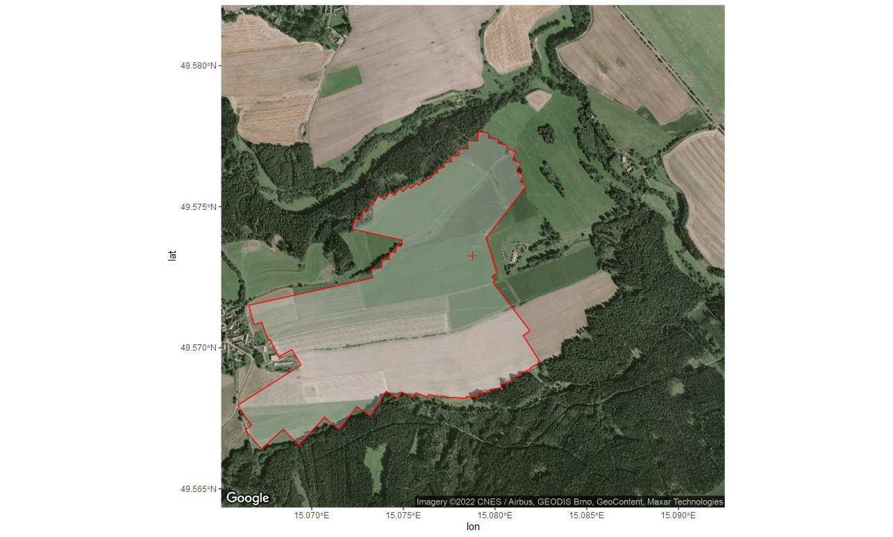

<!-- README.md is generated from README.Rmd. Please edit that file -->

# EC workflow

## Overview

The eddy covariance (EC) workflow demonstrates how to use
[openeddy](https://github.com/lsigut/openeddy) package together with
[REddyProc](https://github.com/bgctw/REddyProc) package to facilitate
automated and reproducible EC data post-processing. The presented EC
workflow is a set of post-processing steps that were applied for a
particular cropland site
[CZ-KrP](http://www.europe-fluxdata.eu/home/site-details?id=CZ-KrP). The
main purpose of EC workflow is to show how to utilize the software
infrastructure. It is not meant to represent the optimal best
post-processing workflow, especially concerning the quality control. The
`openeddy` provides enough flexibility for users to adapt
post-processing to specifics of their site and will hopefully facilitate
discussion and exchange of best practices concerning various types of
ecosystems and EC setups.

## Requirements

The EC workflow is currently aligned with `EddyPro` software
[output](https://www.licor.com/env/support/EddyPro/topics/output-files-full-output.html).
It is expected that meteorological data passed its own separate workflow
(not covered by `openeddy`) and are already converted to physical units
and underwent quality control. Although `KRP16` site-year example below
contains already gap-filled meteorological data, gaps are allowed.
Processing of multiple or incomplete years is supported. In case of
multiple years, edits in EC workflow scripts are required.

Adapting workflow for a new site mainly requires column renaming,
preferably within EC workflow code (alternatively directly in input
data). Support for other EC processing
[software](https://fluxnet.org/2017/10/10/toolbox-a-rolling-list-of-softwarepackages-for-flux-related-data-processing/)
(e.g. TK3, EdiRe, EddyUH, EddySoft) is not explicitly provided but
alternative workflow should be achievable already with the existing
`openeddy` capabilities. The easiest approach could be to `remap_vars()`
using the pairing of column names of `EddyPro` full output and the EC
processing software used. `EddyPro`-specific tests/filters mainly
present in `extract_QC()` would need to be substituted for their
alternatives. The `KRP16` micrometeorological (meteo) data are formatted
in a specific way that is handled by specialized function
`read_MeteoDBS()`. To achieve similar results, you can use `read_eddy()`
in combination with `merge_eddy()` to read and validate general data
frame with meteo data.

In order to run `fetch_filter()`, QC workflow also requires the region
of interest (ROI) outline for given site-year. ROI is provided by the
user in a form of numeric vector (see *ROI boundary* section below and
<https://github.com/lsigut/ROI_boundary>).

## Usage

To run EC workflow for the example site-year KRP16:

Download `KRP16 - before processing.zip` from
[Zenodo](https://doi.org/10.5281/zenodo.6631498) and unzip. Run workflow
files in specified order according to instructions there:

1.  `data_preparation` workflow: formatting and merging inputs.
2.  `QC` workflow: eddy covariance quality control.
3.  `GF_&_FP` workflow: uStar-filtering, gap-filling and flux
    partitioning.
4.  `Summary` workflow: aggregation and summary of results.

All workflows should be first adapted to given site-year properties and
commands run one by one, following the included instructions suggesting
edits when needed. The workflow files are structured so that mostly only
the upper sections require user inputs while the remainder is mostly
automated.

Note that sourcing the QC workflow will not produce desired outcome if
variable `interactive = TRUE` because interactive functions are
included. Once the manual QC is finalized and automatically saved,
changing to `interactive = FALSE` allows to reproduce all results by
sourcing all workflows.

You can compare your results with those of `KRP16 - processed.zip` at
[Zenodo](https://doi.org/10.5281/zenodo.6631498). Notice that in order
to obtain identical results, you would need to copy the subjective
manual screening done by site PI located at
`./Level 2/Quality checking/KRP16_manual_QC.csv`.

## Description

The proposed workflow allows to process eddy covariance data with single
processing chain consisting of four stages:

1.  **Storage:** estimate storage flux to allow for storage correction.
    Computation of storage flux from profile measurements is currently
    not available. `EddyPro` full output provides storage fluxes
    computed by [discrete (one point)
    approach](https://www.licor.com/env/support/EddyPro/topics/calculate-storage-fluxes.html).
    While this is sufficient for sites with short canopy (e.g. the
    example cropland site `CZ-KrP`), one point approximation is less
    suitable with increasing EC measurement height. Implementation of
    profile measurements for computation of storage flux is outside of
    scope of `openeddy` package.

2.  **Quality control (QC):** load the `EddyPro` output and gap-filled
    meteorological data and apply automated tests and filters
    implemented in [openeddy](https://github.com/lsigut/openeddy) to
    quality check fluxes of momentum (Tau), sensible (H) and latent heat
    (LE) and net ecosystem exchange (NEE). Export documentation of
    applied QC and produce the outputs needed in next steps. QC workflow
    produces files at `.\Level 2\Quality checking\` and
    `.\Level 2\Input for gap-filling\` folders.

3.  **Gap-filling and flux partitioning (GF & FP):** combine utilities
    of [REddyProc](https://github.com/bgctw/REddyProc) and
    [openeddy](https://github.com/lsigut/openeddy) to gap-fill (H, LE,
    NEE), partition (NEE) and visualize (H, LE, NEE) fluxes. The setup
    allows to change and document some processing options in an
    organized way. Computation of bootstrapped friction velocity
    threshold is included. GF & FP workflow produces files at
    `.\Level 3\Gap-filling\REddyProc\`.

4.  **Summary:** visualize processed data, convert units and aggregate
    results to daily, weekly, monthly and yearly timescales. A limited
    amount of computed parameters is also produced, including different
    uncertainty estimates. Summary workflow produces files at
    `.\Level 3\Summary\REddyProc\`.

The EC workflow assumes certain folder structure that makes data
handling more effective. The folder structure can be created using
`structure_eddy()`.


-   Level 0: raw data, related metadata and configuration files.
-   Level 1: half-hourly data processed by `EddyPro` and gap-filled
    meteorological data.
-   Level 2: results and documentation of QC, storage corrected fluxes
    for GF & FP.
-   Level 3: results of GF & FP and the dataset summaries.

The complete processing chain in the context of above folder structure
can be summarized as:


## ROI boundary

The outline delimiting the spatial extent of the studied ecosystem
(region of interest; ROI) is specified by its ROI boundary that
describes the distance from EC tower to the edge of the studied
ecosystem for given wind direction. In order to work with
[openeddy](https://github.com/lsigut/openeddy), ROI boundary has to be
provided as a numeric vector with following properties:

-   The number of circular sectors is the same as the number of provided
    distances (length of the vector).
-   The angular resolution of the ROI boundary is given by
    `360° / number of angular sectors`.
-   The ROI boundary distances are assigned to the centers of their
    respective circular sectors with first sector centered on 0°.

### ROI boundary example


In this simplified case ROI boundary would be specified as:

``` r
c(150, 200, 250, 300)
```

**Interpretation:**

-   There would be 4 circular sectors with 90° angular resolution.
-   ROI boundary is specified for the whole first sector (315°, 45°\] at
    the distance 150 m from tower (center of the sector is 0°).
-   Boundary of the second sector (45°, 135°\] is at the distance 200 m.
-   Third sector (135°, 225°\] is at the distance 250 m.
-   Fourth sector (225°, 315°\] is at the distance 300 m.

Realistic representation of ROI boundary can look e.g. like this:



## Naming strategy with the EC workflow

In order to take advantage of `openeddy` default arguments, certain
naming strategy is recommended.

`EddyPro` full output [variable
names](https://www.licor.com/env/support/EddyPro/topics/output-files-full-output.html)
are used with a few modifications if symbols were included in the
variable name (e.g. Monin-Obukhov stability parameter `(z-d)/L` is
corrected to `zeta`).

Expected names of meteorological variables are due to historical
reasons:

-   GR: global radiation \[W m-2\]
-   PAR: photosynthetically active radiation \[umol m-2 s-1\]
-   Rn: net radiation \[W m-2\]
-   Tair: air temperature at EC height \[degC\]
-   Tsoil: soil temperature at soil surface \[degC\]
-   RH: relative humidity at EC height \[%\]
-   VPD: vapor pressure deficit at EC height \[hPa\]
-   P: precipitation \[mm\]

`openeddy` offers full flexibility concerning QC column names. However,
in order to avoid QC column duplication and to partly document the type
of QC test/filter and flux that it corresponds to, following naming
strategy was devised:

### QC prefixes

They specify which flux is affected by given QC column:

-   qc_Tau\_, qc_H, qc_LE, qc_NEE: only applicable for the respective
    fluxes.
-   qc_SA\_: applicable to fluxes relying only on sonic (Tau, H).
-   qc_GA\_: applicable to fluxes relying on GA (LE, NEE); only GA
    issues considered.
-   qc_SAGA\_: applicable to fluxes relying both on SA and GA (LE, NEE);
    both SA and GA issues considered.
-   qc_ALL\_: applicable to all fluxes (in practice often not applied to
    Tau).

### QC suffixes

They specify which QC test/filter was applied to get the QC flags:

-   \_SS_ITC: steady state test and test of integral turbulence
    characteristics.
-   \_instrum: flags assigned during the quality assurance phase.
-   \_abslim: check of [absolute
    limits](https://www.licor.com/env/support/EddyPro/topics/despiking-raw-statistical-screening.html#Absolutelimits).
-   \_spikesHF: check of [high frequency data
    spike](https://www.licor.com/env/support/EddyPro/topics/despiking-raw-statistical-screening.html#Despiking)
    percentage in averaging period against thresholds.
-   \_missfrac: check of missing data in averaging period against
    thresholds.
-   \_scf: check of spectral correction factor against thresholds.
-   \_wresid: check of mean unrotated w (double rotation) or w residual
    (planar fit) against thresholds.
-   \_thr_X: user-defined thresholds for a variable X
    (e.g. \_thr_tsvar).
-   \_runs: check of runs with repeating values.
-   \_lowcov: threshold test for unreasonably low fluxes (assuming
    issues during covariance computation).
-   \_interdep: flux interdependency.
-   \_man: manual quality control.
-   \_spikesLF: identification of likely outliers in low frequency data.
-   \_fetch70: check of distance corresponding to [70% signal
    contribution](https://www.licor.com/env/support/EddyPro/topics/estimating-flux-footprint.html)
    against fetch distance for given wind direction.  
-   \_forGF: the composite QC column used to screen fluxes for
    gap-filling combining selected above test/filter results.

Note that \_abslim and \_spikesHF have thresholds set already within
`EddyPro`. Thus change of thresholds can be achieved only by additional
raw data re-processing.

`REddyProc` naming strategy is available at [MPI Online Tool
website](https://www.bgc-jena.mpg.de/bgi/index.php/Services/REddyProcWebOutput).

## Manual QC guide

Theoretically, manual QC is introducing subjectivity to the workflow and
should be avoided. However, in practice, certain events can occur that
might be difficult to screen based on auxiliary data or the tests are
not sensitive enough to capture them. It should be noted that data not
falling within the expected range might represent interesting rare
phenomena and should be carefully investigated before manual removal.
The screening typically depends on the user experience with the site,
considering meteo conditions and phenology. Examples of manually
excluded half-hours could be those affected by precipitation, strong
advection and unexpected technical issues. Neighbors of outlying values
or isolated points can be good candidates for exclusion as they might
have escaped the automated screening. Change of weather fronts can lead
to unexpected energy fluxes that however reflect real conditions. In
these conditions it could depend on the research question whether such
cases should be excluded.

## Abbreviations

-   EC: Eddy Covariance
-   QC: Quality Control
-   SA: Sonic Anemometer
-   GA: Gas Analyzer
-   Tau: Momentum flux \[kg m-1 s-2\]
-   H: Sensible heat flux \[W m-2\]
-   LE: Latent heat flux \[W m-2\]
-   NEE: Net ecosystem exchange \[umol m-2 s-1\]
-   u: Longitudinal wind speed component \[m s-1\]
-   w: Vertical wind speed component \[m s-1\]
-   ts: Sonic temperature \[degC\]
-   h2o: H2O concentration \[mmol mol-1\]
-   co2: CO2 concentration \[umol mol-1\]

## References

Publication describing `openeddy` is not yet available. When describing
the proposed quality control scheme, please refer to it as similar to:

Mauder, M., Cuntz, M., Drüe, C., Graf, A., Rebmann, C., Schmid, H.P.,
Schmidt, M., Steinbrecher, R., 2013. A strategy for quality and
uncertainty assessment of long-term eddy-covariance measurements. Agric.
For. Meteorol. 169, 122-135,
<https://doi.org/10.1016/j.agrformet.2012.09.006>

The methodology and benchmark of `REddyProc 1.1.3` is described in the
following paper:

Wutzler, T., Lucas-Moffat, A., Migliavacca, M., Knauer, J., Sickel, K.,
Šigut, L., Menzer, O., and Reichstein, M. (2018): Basic and extensible
post-processing of eddy covariance flux data with REddyProc,
Biogeosciences, 15, 5015-5030,
<https://doi.org/10.5194/bg-15-5015-2018>.
